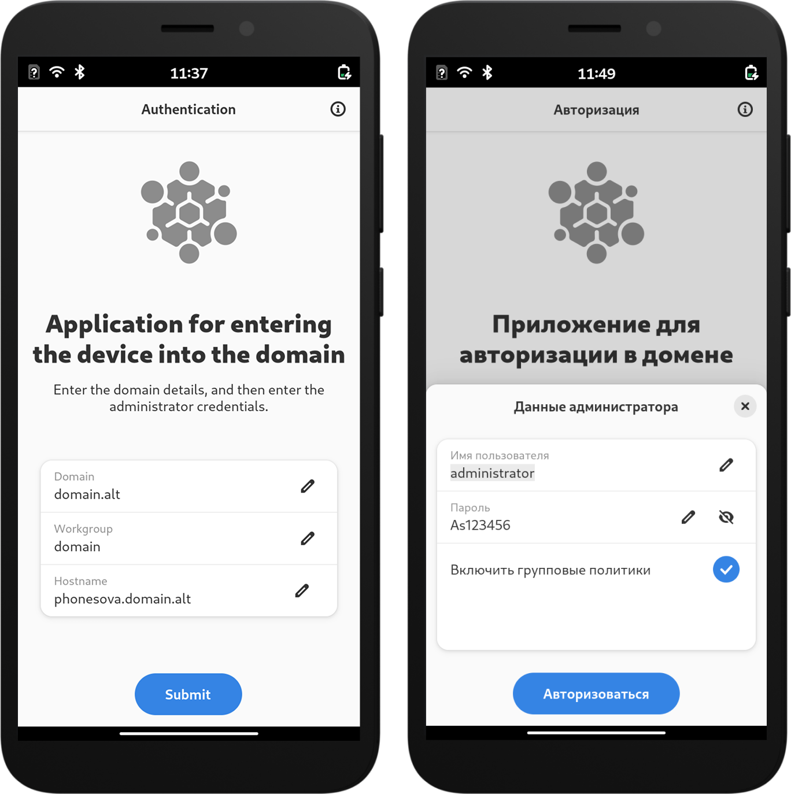

<div align="center">
<h1>
    
    Mobile Auth
  </h1>
</div>
<div align="center"><h4>GTK4/Python application designed for authentication of devices based on OS Alt Mobile  in Samba DC and Active Directory domains.</h4></div>

<div align="center">
  
</div>

# Install
### ALT Linux
```shell
su -
apt-get install mobile-auth
```

## Building

#### Dependencies:

* `gtk4`, version: `>= 4.14`
* `libadwaita-1`, version: `>= 1.5`
* `glib-2.0`, version: `>= 2.67.1`
* `pygobject-3.0`, version: `>= 3.47.0`
* `alterator-auth`
* `alterator-manager`
* `alterator-module-executor`
* `git`, only for `devel`

#### Building utilities:

* `meson`
* `ninja`
* `blueprint-compiler`
* `valac`
* `pkg`

### PreRelease

```shell
meson setup _build
```

#### Install
```shell
sudo ninja install -C _build
```

#### Testing
```shell
ninja -C _build test
```

#### Uninstal
```shell
sudo ninja uninstall -C _build
```